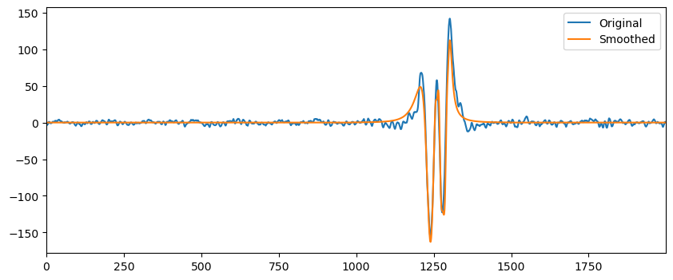
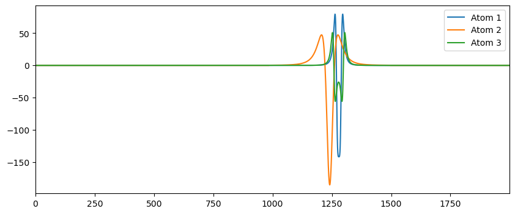

# Convolutional Sparse Coding with Multipath Orthogonal Matching Pursuit

Python implementation of the algorithm described in (Gomes et al., 2024):

- Gomes, Y., Truong, C., Saut, J.-P., Hafid, F., Prieur, P., & Oudre, L. (2024). Convolutional sparse coding with multipath orthogonal matching pursuit.


## Install
To install the Python package, run in a terminal:

```bash
python -m pip install git+https://github.com/deepcharles/convmmp
```

## Usage

Here is a code snippet to illustrate our algorithm on sample data (see the `example` folder).

```python
import numpy as np
import matplotlib.pyplot as plt
from mpcsc import multipathcsc  # our library
```

#### Load data

```python
data = np.load("example_data.npz")
signal = data["signal"]
dictionary = data["dictionary"]

print(f"{signal.shape = } (n_samples, n_dims)")
print(f"{dictionary.shape = } (n_atoms, n_samples_atom, n_dims)")
```

    signal.shape = (2000, 1) (n_samples, n_dims)
    dictionary.shape = (143, 512, 1) (n_atoms, n_samples_atom, n_dims)

#### Convolution sparse coding with multipath

```python
# This line is long to execute the first time, because code is compiled.
approx, time_idxs, atom_idxs, vals, path = multipathcsc(signal=signal, dictionary=dictionary, n_atoms_to_find=3, n_paths=5)
print(f"The best solution was obtained with path {path}.")
```

    The best solution was obtained with path [1 0 0].

-   `approx` contains the best approximation of `signal`.
-   `time_idxs` contains the time indexes of the selected atoms.
-   `atom_idxs` contains the indexes of the selected atoms.
-   `vals` contains the multiplicative factors to scale the atoms (which
    have unit norm).
-   `path` is the path of the best solution.

```python
fig, ax = plt.subplots(figsize=(10, 4))
ax.plot(signal, label="Original")
ax.plot(approx, label="Smoothed")
plt.legend()
ax.set_xmargin(0)
```



#### Decomposition

```python
fig, ax = plt.subplots(figsize=(10, 4))
# ax.plot(signal, label="Original")
ax.set_xmargin(0)
n_samples_atom = dictionary.shape[1]
for k_atom in range(time_idxs.size):
    approx_single_atom = np.zeros_like(signal)
    start = time_idxs[k_atom]
    end = start + n_samples_atom
    atom = dictionary[atom_idxs[k_atom]]
    val = vals[k_atom]
    approx_single_atom[start:end] = val * atom
    ax.plot(approx_single_atom, label=f"Atom {k_atom+1}")
plt.legend()
```


